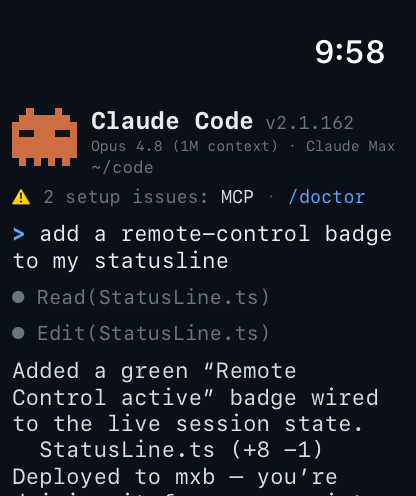
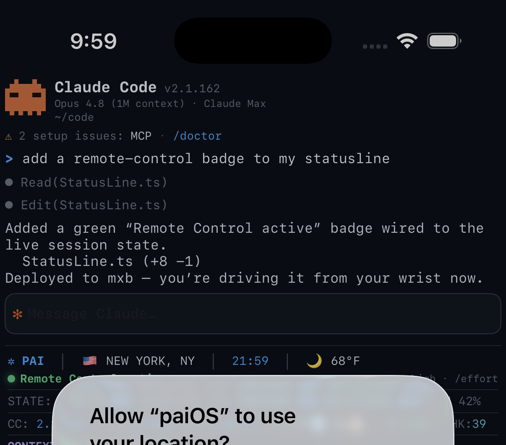

# paiOS

**Bringing PAI to your pocket — and your wrist.**

A [PAI](https://ourpai.ai) (Personal AI Infrastructure) client for iPhone and Apple Watch, powered entirely by Apple's on‑device **Foundation Models**. You talk to your agent from your wrist; your phone runs the model. Nothing leaves the device.

<p align="center">
  <br>
   
</p>

---

## What it is

- **iPhone app + Apple Watch companion.** Raise your wrist, type or dictate, and drive a Claude‑Code‑style session from the watch.
- **The iPhone is the brain.** The watch relays your prompt to the paired iPhone over WatchConnectivity; the iPhone generates the reply on‑device and streams it back.
- **The seven PAI Algorithm phases** — Observe → Think → Plan → Build → Execute → Verify → Learn — each announced aloud, with a spoken summary of the result.
- **The PAI statusline** you know from the terminal: live clock, location and weather, context meter, usage, and learning signals — rendered for the wrist.

## On‑device intelligence

paiOS runs on **Apple's Foundation Models framework** (iOS 26+). The model is a **~3‑billion‑parameter** language model that ships inside the OS and runs on the Apple Neural Engine:

- **~3.18B parameters**, compressed with **quantization‑aware training** to a mixed 2‑/4‑bit scheme (~3.7 bits per weight on average), so it fits in memory and runs on‑device.
- **4096‑token context window**, shared across the system prompt, transcript, and response.
- **Fully private and offline** — inference happens entirely on the Neural Engine. No network, no API key, no per‑token cost.
- Accessed through `SystemLanguageModel.default` with a runtime **availability** check (`deviceNotEligible` / `appleIntelligenceNotEnabled` / `modelNotReady`), and driven via `LanguageModelSession` (`respond(to:)` and streaming `streamResponse(to:)`).

The model itself is **iOS / iPadOS / macOS / visionOS only** — it does not run on watchOS. paiOS bridges that gap: the watch is a thin remote, and the paired iPhone (A17 Pro / A18 / M‑series and newer) does the generation.

## Architecture

```
 Apple Watch                          iPhone
┌──────────────┐   WatchConnectivity ┌──────────────────────────┐
│  Claude Code │  ───  prompt  ────▶ │  FoundationModels         │
│  UI + voice  │                     │  LanguageModelSession      │
│  (the remote)│  ◀── reply ──────── │  (on‑device ~3B model)     │
└──────────────┘                     └──────────────────────────┘
```

- **Watch** (`paiOS Watch App`) — the terminal UI, the throbber, the seven‑phase narration, and the spoken summary. Sends prompts via `WCSession.sendMessage`.
- **iPhone** (`paiOS`) — runs the same UI *and* hosts the model. Answers the watch's prompts with `Intelligence.respond(to:)`, and generates directly when used on the phone.
- **Voice** — phase announcements are pre‑rendered (ElevenLabs); the generated summary is spoken with Apple's native on‑device TTS (Australian "Lee").

## Build

```bash
xcodegen generate      # regenerate paiOS.xcodeproj from project.yml
open paiOS.xcodeproj
```

Select the **paiOS** scheme, pick your iPhone, and Run — Xcode installs the watch app to your paired Apple Watch automatically. Apple Intelligence must be enabled on the iPhone for on‑device generation.

Built with SwiftUI · FoundationModels · WatchConnectivity · AVFoundation.

## PAI

paiOS is a client for **PAI — Personal AI Infrastructure**, created by Daniel Miessler.

- 🌐 [ourpai.ai](https://ourpai.ai)
- 📦 [github.com/danielmiessler/PAI](https://github.com/danielmiessler/PAI)
